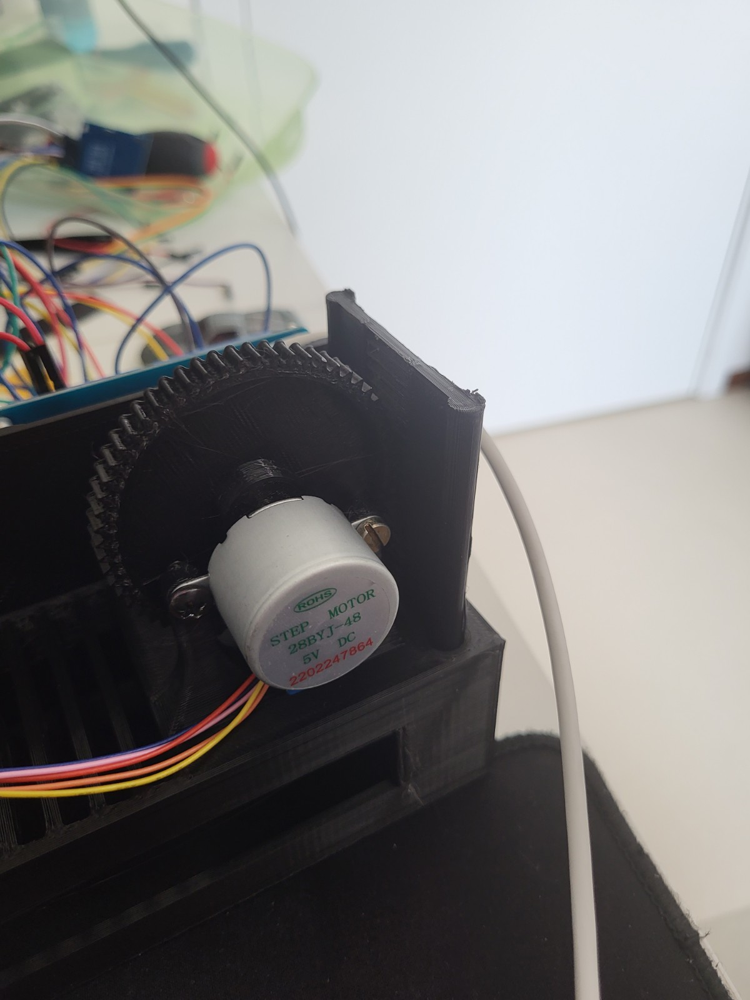
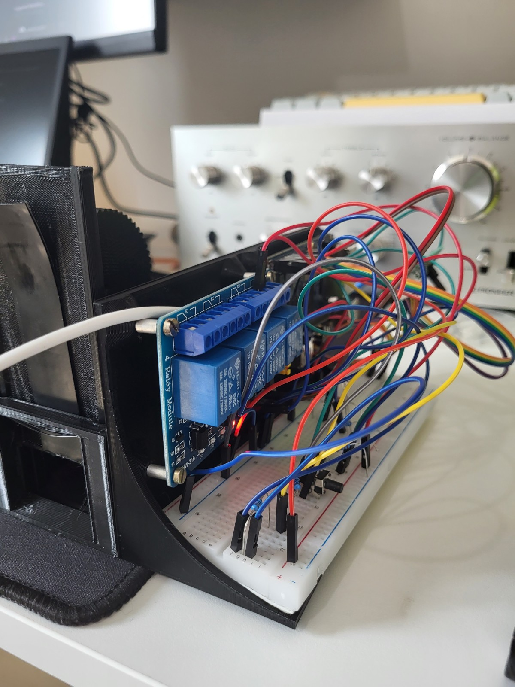
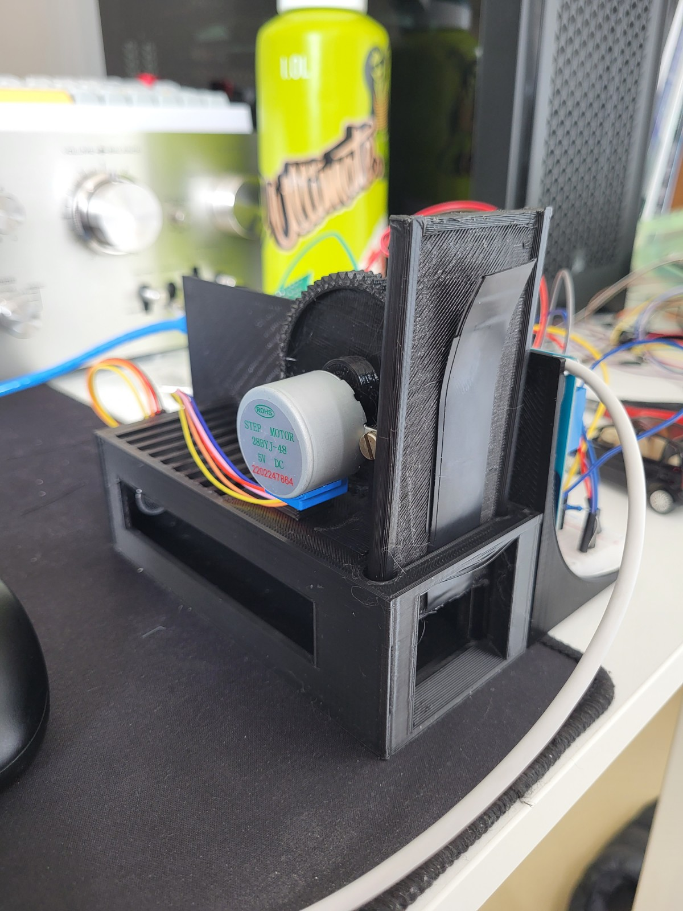
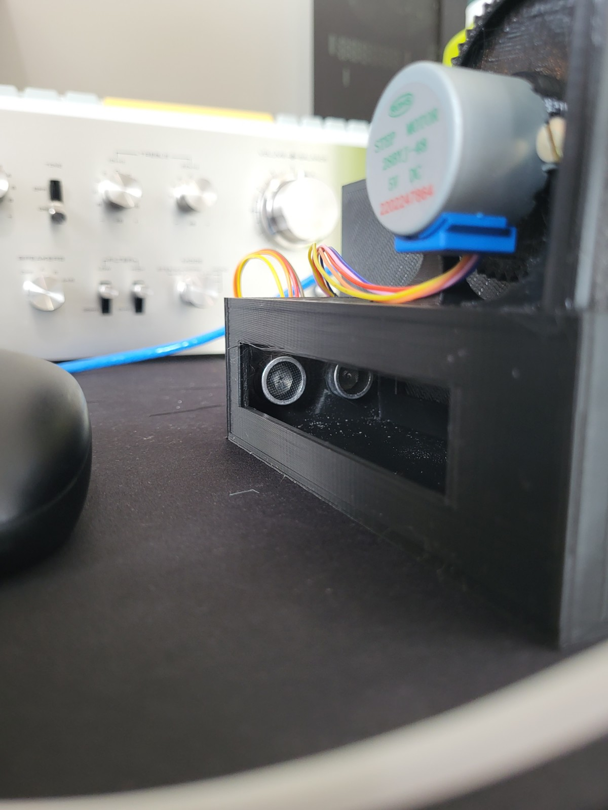
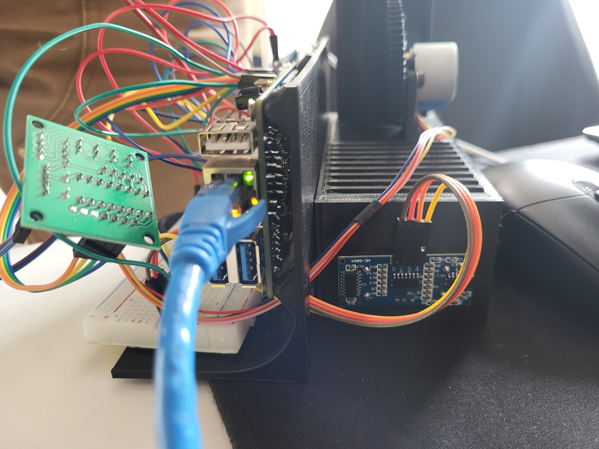
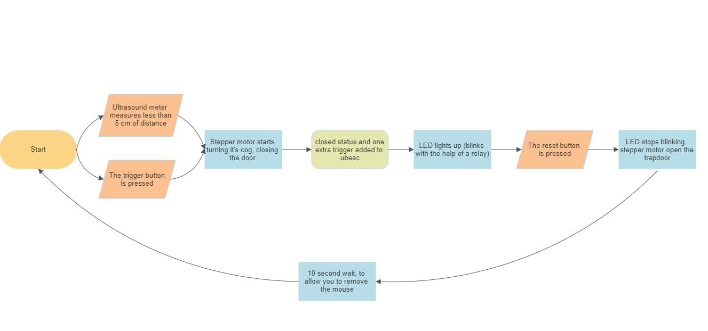

# Arne_Muijshondt_1ITF05_r0938846_IOT_project
This repository contains everything to make an automatic mouse trap. 
I made this project for my course IoT Essentials.

> **Note:** This is a **private** repo, containing **individual work**.
Plagiarism is a serious offense with real consequences.

| Student | Info       |
| --- |------------|
| First Name | Arne       |
| Last Name| Muijshondt |
| Class | 1ITF05     |

# Parts list
 1. 4 channel relay module
2. Breadboard 830
3. Momentary tactile button (2 pcs)
4. Orange pi 3 lts
5. SR04 ultrasonic sensor
6. stepper motor
7. ULN2003
8. 1K weerstand (4 pcs)
9. 10K weerstand (1pcs)
10. M3 bolt (8pcs)
11. M3 standoffs (4 pcs)
12. M4 bolt (2pcs)
13. strip of double sided tape (2pcs)
14. plenty of jumper cables (M-M, F-M, F-F)

# A couple of pictures of my build

# My code visualized in a block diagram

